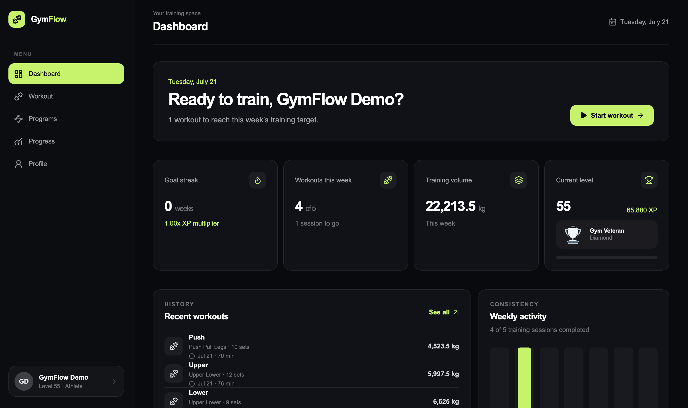
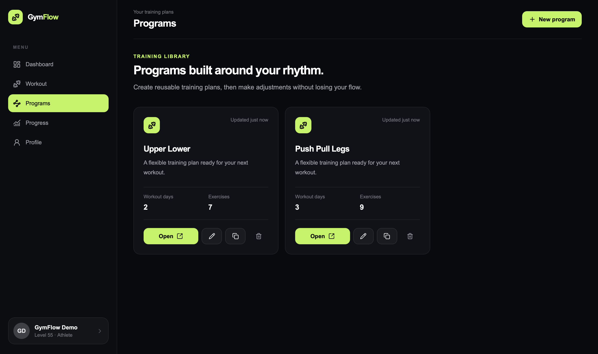
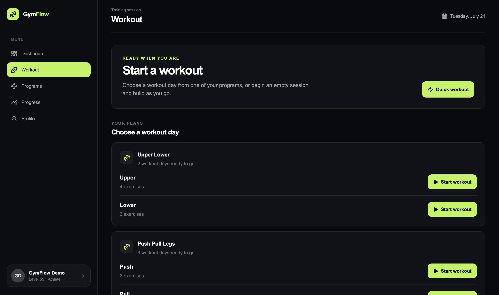
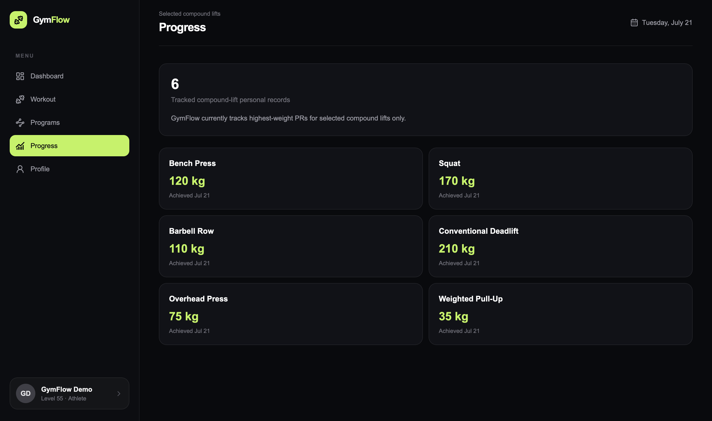
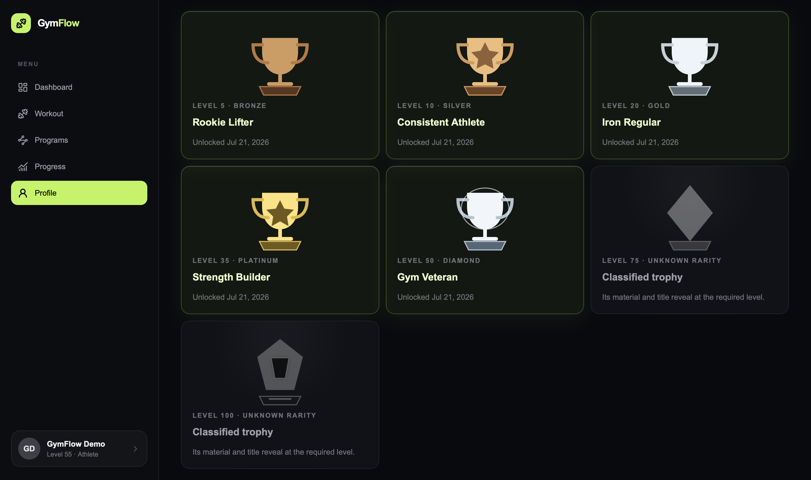
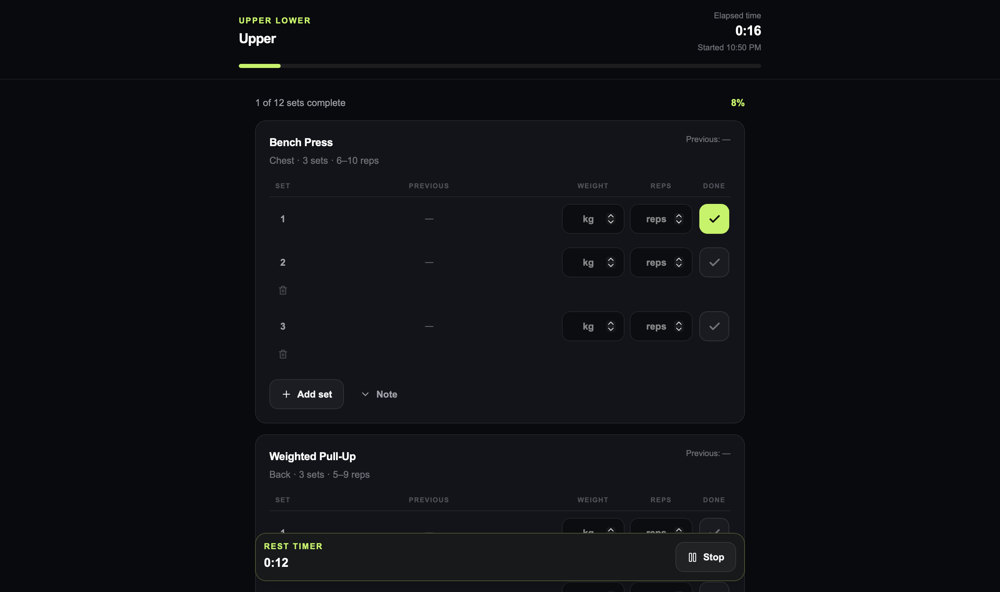

# GymFlow

**GymFlow** is a deployed full-stack fitness tracker for planning workouts, logging training, and following progress over time. It uses authenticated, per-user data so each athlete has a private training space.

**Live demo:** [gymflow-90eh.vercel.app](https://gymflow-90eh.vercel.app)

Sign in with Google or create an email/password account to get started.

## Product Preview

<p align="center">
  
</p>

<p align="center">
  Personalized training dashboard with progression, weekly activity and recent workouts.
</p>

### Core Experience

<table>
  <tr>
    <td width="50%">
      
      <p align="center"><strong>Workout Programs</strong><br />Build and manage reusable training plans.</p>
    </td>
    <td width="50%">
      
      <p align="center"><strong>Workout Flow</strong><br />Choose a planned day or start a quick workout.</p>
    </td>
  </tr>
  <tr>
    <td width="50%">
      
      <p align="center"><strong>Progress &amp; Personal Records</strong><br />Track selected compound-lift milestones.</p>
    </td>
    <td width="50%">
      
      <p align="center"><strong>Achievements</strong><br />Unlock trophies as training progression grows.</p>
    </td>
  </tr>
  <tr>
    <td colspan="2">
      
      <p align="center"><strong>Workout Logging</strong><br />Record sets, weights and reps during an active session.</p>
    </td>
  </tr>
</table>

## Features

- Google OAuth with PKCE, email/password sign-up and confirmation, sign-in, sign-out, and persisted sessions
- Private workout programs, ordered workout days, global exercise library, and private custom exercises
- Workout logging with persisted sessions, sets, history, duplicate-submission protection, and personal-record updates
- Dashboard statistics, recent workouts, weekly goals, UTC weekly streaks, XP multipliers, levels, trophies, and active achievements
- Profile settings for display name, weekly workout goal, and preferred weight unit
- Responsive dark GymFlow UI with accessible navigation, dialogs, mutation feedback, and empty states

## Tech stack

- Next.js 15 App Router, React 19, and TypeScript
- Tailwind CSS and Lucide icons
- Supabase Auth and Supabase-hosted PostgreSQL
- Prisma 7 with PostgreSQL adapter
- ESLint, Prettier, and Node’s test runner via `tsx`
- Vercel deployment from `main`

## Architecture

The browser uses Next.js App Router pages and client components for interaction. Server Components, Server Actions, and route handlers resolve the authenticated user, enforce ownership, and use Prisma to persist data in Supabase PostgreSQL. See [Architecture](docs/architecture.md) for the authentication, authorization, persistence, and deployment flows.

## Local setup

Prerequisites: Node.js 20.9+ and npm 10+.

```bash
git clone https://github.com/SondreMR/gymflow.git
cd gymflow
npm install
cp .env.example .env.local
```

Set the following values in `.env.local`:

## Environment variables

| Variable                               | Purpose                                                                |
| -------------------------------------- | ---------------------------------------------------------------------- |
| `NEXT_PUBLIC_APP_NAME`                 | Optional display name; defaults to `GymFlow`.                          |
| `NEXT_PUBLIC_APP_URL`                  | Local or deployed application URL; used to construct `/auth/callback`. |
| `NEXT_PUBLIC_SUPABASE_URL`             | Supabase project URL.                                                  |
| `NEXT_PUBLIC_SUPABASE_PUBLISHABLE_KEY` | Browser-safe Supabase publishable key.                                 |
| `DATABASE_URL`                         | Server-only Prisma runtime connection string.                          |
| `DIRECT_URL`                           | Direct PostgreSQL connection for Prisma CLI and migrations.            |

`npm install` runs `prisma generate` through `postinstall`. Apply pending migrations to a development database when appropriate, then start the app:

```bash
npm run prisma:migrate
npm run dev
```

For Google OAuth, configure the provider in Supabase and add `${NEXT_PUBLIC_APP_URL}/auth/callback` to Supabase Auth Redirect URLs. In production, `NEXT_PUBLIC_APP_URL` must be the production app URL.

Never commit `.env.local`, database URLs containing passwords, OAuth client secrets, or Supabase secret/service-role keys. `NEXT_PUBLIC_` values are embedded in the client bundle; only browser-safe values belong there.

## Validation and testing

```bash
npm run format:check
npm run lint
npm run typecheck
npm run test:unit
npm run build
```

## Roadmap

See the [roadmap](docs/roadmap.md) for completed foundation work and future ideas.

## Documentation

- [Architecture](docs/architecture.md)
- [Data model](docs/data-model.md)
- [Dashboard metrics](docs/dashboard-metrics.md)
- [Progression](docs/progression.md)
- [Roadmap](docs/roadmap.md)
