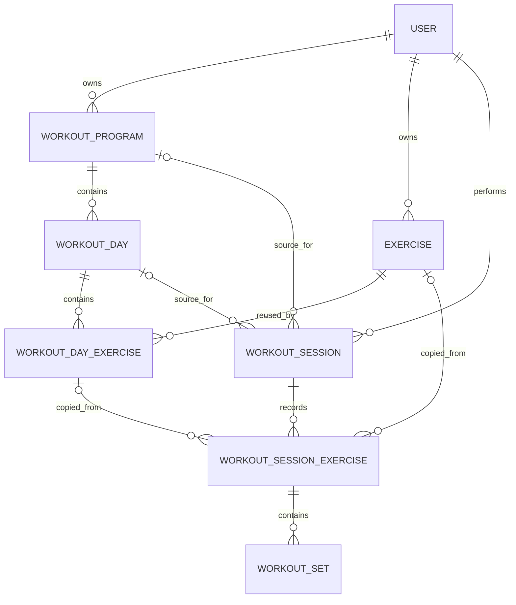

# GymFlow data model

## Purpose and scope

This document proposes the persistence model for workout programs before Prisma, authentication, or a database are introduced. It is designed for a relational database (PostgreSQL is the recommended first target) and assumes that every record is scoped to an authenticated user once identity is added.

The current application is a static shell. Its dashboard and program routes use no data access, so this proposal does not require any UI or application-code change.

## Domain boundaries

| Concept                | Purpose                                                                                   | Lifecycle                                        |
| ---------------------- | ----------------------------------------------------------------------------------------- | ------------------------------------------------ |
| User                   | Future owner boundary for all private data.                                               | Created by the future identity provider.         |
| WorkoutProgram         | Reusable training-plan template.                                                          | User-created and editable.                       |
| WorkoutDay             | Ordered template day within one program, such as Push or Pull.                            | Exists only within its program.                  |
| Exercise               | User-owned reusable exercise definition.                                                  | Can be reused in any of the owner’s programs.    |
| WorkoutDayExercise     | Ordered placement of an exercise in one workout day, including its template prescription. | Exists only within that workout day.             |
| WorkoutSession         | One active or completed occurrence of a planned workout day.                              | Historical event; preserves its source snapshot. |
| WorkoutSessionExercise | Exercise performed in one session, copied from the template at session start.             | Historical event within a session.               |
| WorkoutSet             | One logged set performed during a session.                                                | Historical event within a session exercise.      |

`WorkoutDayExercise` is deliberately a join entity rather than a direct many-to-many relationship: a single exercise can appear in several workout days, each with its own position, target-set count, and rep range.

## Proposed Prisma schema

This is a proposal, not an installed schema. The `@db.Decimal` annotations assume PostgreSQL and should be revisited if the selected provider changes.

```prisma
enum WorkoutSessionStatus {
  ACTIVE
  COMPLETED
  ABANDONED
}

enum WorkoutSetKind {
  WARMUP
  WORKING
  DROP
}

model User {
  id              String           @id @default(cuid())
  createdAt       DateTime         @default(now())
  updatedAt       DateTime         @updatedAt
  programs        WorkoutProgram[]
  exercises       Exercise[]
  workoutSessions WorkoutSession[]
}

model WorkoutProgram {
  id          String       @id @default(cuid())
  userId      String
  name        String
  description String?
  createdAt   DateTime     @default(now())
  updatedAt   DateTime     @updatedAt

  user     User         @relation(fields: [userId], references: [id], onDelete: Cascade)
  days     WorkoutDay[]
  sessions WorkoutSession[]

  @@index([userId, updatedAt])
}

model WorkoutDay {
  id        String       @id @default(cuid())
  programId String
  name      String
  position  Int
  createdAt DateTime     @default(now())
  updatedAt DateTime     @updatedAt

  program  WorkoutProgram       @relation(fields: [programId], references: [id], onDelete: Cascade)
  exercises WorkoutDayExercise[]
  sessions WorkoutSession[]

  @@unique([programId, position])
  @@index([programId])
}

model Exercise {
  id          String       @id @default(cuid())
  userId      String
  name        String
  description String?
  createdAt   DateTime     @default(now())
  updatedAt   DateTime     @updatedAt

  user            User                     @relation(fields: [userId], references: [id], onDelete: Cascade)
  workoutDayLinks WorkoutDayExercise[]
  sessionExercises WorkoutSessionExercise[]

  @@unique([userId, name])
  @@index([userId])
}

model WorkoutDayExercise {
  id             String      @id @default(cuid())
  workoutDayId   String
  exerciseId     String
  position       Int
  targetSets     Int
  targetRepMin   Int?
  targetRepMax   Int?
  createdAt      DateTime    @default(now())
  updatedAt      DateTime    @updatedAt

  workoutDay WorkoutDay @relation(fields: [workoutDayId], references: [id], onDelete: Cascade)
  exercise   Exercise   @relation(fields: [exerciseId], references: [id], onDelete: Cascade)
  sessionExercises WorkoutSessionExercise[]

  @@unique([workoutDayId, position])
  @@unique([workoutDayId, exerciseId])
  @@index([exerciseId])
}

model WorkoutSession {
  id                 String               @id @default(cuid())
  userId             String
  sourceProgramId    String?
  sourceWorkoutDayId String?
  programName        String
  workoutDayName     String
  status             WorkoutSessionStatus @default(ACTIVE)
  startedAt          DateTime             @default(now())
  completedAt        DateTime?
  createdAt          DateTime             @default(now())
  updatedAt          DateTime             @updatedAt

  user             User                     @relation(fields: [userId], references: [id], onDelete: Cascade)
  sourceProgram    WorkoutProgram?          @relation(fields: [sourceProgramId], references: [id], onDelete: SetNull)
  sourceWorkoutDay WorkoutDay?              @relation(fields: [sourceWorkoutDayId], references: [id], onDelete: SetNull)
  exercises        WorkoutSessionExercise[]

  @@index([userId, startedAt])
  @@index([sourceWorkoutDayId])
}

model WorkoutSessionExercise {
  id                   String       @id @default(cuid())
  workoutSessionId     String
  sourceDayExerciseId  String?
  sourceExerciseId     String?
  exerciseName         String
  position             Int
  createdAt            DateTime     @default(now())
  updatedAt            DateTime     @updatedAt

  workoutSession    WorkoutSession     @relation(fields: [workoutSessionId], references: [id], onDelete: Cascade)
  sourceDayExercise WorkoutDayExercise? @relation(fields: [sourceDayExerciseId], references: [id], onDelete: SetNull)
  sourceExercise    Exercise?           @relation(fields: [sourceExerciseId], references: [id], onDelete: SetNull)
  sets              WorkoutSet[]

  @@unique([workoutSessionId, position])
  @@index([sourceExerciseId])
}

model WorkoutSet {
  id                       String                 @id @default(cuid())
  workoutSessionExerciseId String
  position                 Int
  kind                     WorkoutSetKind         @default(WORKING)
  weightKg                 Decimal?               @db.Decimal(7, 2)
  reps                     Int?
  isCompleted              Boolean                @default(true)
  createdAt                DateTime               @default(now())
  updatedAt                DateTime               @updatedAt

  workoutSessionExercise WorkoutSessionExercise @relation(fields: [workoutSessionExerciseId], references: [id], onDelete: Cascade)

  @@unique([workoutSessionExerciseId, position])
}
```

## Relationship diagram



## Ownership and access rules

1. A user owns every program, custom exercise, and session. No cross-user reads or writes are permitted.
2. A workout day inherits ownership from its program. A day must never be attached to a program owned by another user.
3. An exercise can only be linked to workout days in programs owned by the same user as the exercise.
4. A session must be created for its owner. If it has a source program or workout day, both sources must belong to that same owner and the day must belong to the source program.
5. Session exercises and sets are private through their session. They are never attached to a program template.
6. All authorization checks must use the authenticated user ID in the query predicate or transaction, not a client-supplied owner ID.

## Ordering and template rules

Positions are zero-based integers. `WorkoutDay.position` orders days inside a program; `WorkoutDayExercise.position` orders exercises inside a day. The compound unique constraints make duplicate positions impossible after a transaction completes.

Reorder operations must run in a transaction. A safe approach is to write temporary unique positions, then write the final contiguous range (`0..n-1`). This avoids transient uniqueness conflicts when records swap positions. Adding or removing an item should also renumber its siblings in the same transaction.

The compound `@@unique([workoutDayId, exerciseId])` prevents accidentally adding the same exercise twice to one workout day. If a future workout builder needs duplicate slots (for example, the same exercise in two separate circuits), remove that constraint and introduce an explicit `block` or `group` concept rather than relying on duplicates with unclear meaning.

## Session snapshot behavior

Starting a workout from a template should run in one transaction:

1. Read the selected program, day, and ordered `WorkoutDayExercise` rows after verifying ownership.
2. Create a `WorkoutSession` with `programName` and `workoutDayName` copied from the template.
3. Create ordered `WorkoutSessionExercise` rows with `exerciseName` copied from each exercise and references to their source records when available.
4. Create no sets until the user logs them, or optionally create planned blank set rows if the interaction design needs them.

Snapshots prevent later edits to a program, day, exercise name, or target prescription from rewriting completed workout history. `WorkoutSet` belongs to `WorkoutSessionExercise`, and therefore to a single `WorkoutSession`; it never belongs to `WorkoutDayExercise` or another template entity.

## Deletion behavior

| User action                     | Template effect                                                                                                         | Historical-session effect                                                                            |
| ------------------------------- | ----------------------------------------------------------------------------------------------------------------------- | ---------------------------------------------------------------------------------------------------- |
| Delete program                  | Hard-delete its workout days and day-exercise links.                                                                    | Keep sessions; `sourceProgramId` and `sourceWorkoutDayId` become `null`, while copied names remain.  |
| Delete workout day              | Hard-delete its day-exercise links.                                                                                     | Keep sessions; `sourceWorkoutDayId` becomes `null`, while copied day and exercise names remain.      |
| Delete exercise                 | Hard-delete all of its day-exercise links across the owner’s programs. Require a confirmation that lists affected days. | Keep session exercises and sets; `sourceExerciseId` becomes `null` and copied exercise names remain. |
| Delete active/completed session | Hard-delete its session exercises and sets. Require explicit confirmation, especially for completed sessions.           | No template records are affected.                                                                    |

The model uses `SetNull` for historical source references and copied display names as the durable audit snapshot. Program and exercise edits therefore remain safe, while an intentional deletion still removes them from current templates.

## User flow: create and edit a program

### Create a program

1. From Programs, select **New program**.
2. Enter a required name and optional description; save the program shell.
3. Add one or more workout days, naming each day (for example, Push, Pull, Legs).
4. Drag or use accessible move controls to order the days; persist the resulting contiguous positions in one transaction.
5. Open a workout day and select an existing custom exercise or create a new one. New exercises are saved to the user’s reusable exercise library first.
6. Add the selected exercise to the day, set target sets, and optionally specify a rep range.
7. Reorder exercises, review the template, and save. Subsequent changes are autosaved or explicitly saved according to the future UX decision, but each mutation remains an atomic server operation.

### Edit a program

1. Select a program and edit its name or description.
2. Add, rename, reorder, or delete workout days.
3. Within a day, add reusable exercises, edit target sets/rep ranges, reorder, or remove the placement. Removing a placement does not delete the reusable exercise.
4. To edit an exercise name or description globally, open its exercise details. Explain that the change applies anywhere the exercise is currently used, but never changes copied historical session names.
5. Confirm destructive actions. Program deletion explains that the plan is removed but completed session history is retained.

## Validation and edge cases

| Area                   | Rule or edge case                                                                                                                                                                                               |
| ---------------------- | --------------------------------------------------------------------------------------------------------------------------------------------------------------------------------------------------------------- |
| Program                | Name is required after trimming, 1–100 characters; description is optional and capped at 1,000 characters. A user may own multiple programs with the same name initially, though a future UX may discourage it. |
| Workout day            | Name is required after trimming, 1–100 characters. A program can be saved empty; starting a session from an empty day must be blocked with a useful message.                                                    |
| Exercise               | Name is required after trimming, 1–100 characters and unique per user under the chosen database collation. The create flow should normalize whitespace and handle a concurrent duplicate-name conflict.         |
| Prescription           | `targetSets` is an integer from 1 to 20. Rep minimum and maximum are either both null or both integers from 1 to 100, with minimum less than or equal to maximum.                                               |
| Reordering             | Reject IDs outside the parent container, duplicate IDs, incomplete reorder lists, and cross-user IDs. Reorder only the immediate siblings and renumber them contiguously.                                       |
| Concurrent edits       | Use a transaction and compare `updatedAt` (or a future integer version) before saving structural edits. Return a conflict response instead of silently overwriting another device’s reorder.                    |
| Template/session drift | A session copies names and exercise ordering at start. It must not read current template values to render logged history.                                                                                       |
| Deleted sources        | Nullable source IDs are expected. Historical session screens must use snapshots when a source record is absent.                                                                                                 |
| Units and volume       | Store logged weight in canonical kilograms with decimal precision. Convert only for display after a future user-preference decision. Never calculate volume from template prescriptions.                        |
| Partial sessions       | An active session may have no exercises or no sets. A completed session should require at least one completed set; abandoned sessions may remain empty.                                                         |

## Tradeoffs and follow-up decisions

- **Hard-delete templates with session snapshots:** this keeps active template views clean while retaining training history. It requires snapshot fields and careful confirmation UI, but avoids a complex versioned-template system at this stage.
- **User-owned exercises only:** custom exercises have clear privacy and ownership. A future curated global catalog can be added as a separate source or visibility model without weakening private ownership.
- **No `ProgramVersion` yet:** versioning is valuable for advanced history and coaching, but snapshots cover the current requirement with less complexity. Add immutable program revisions only when users need to compare history against past plan versions.
- **No set prescription table yet:** target-set count and rep range meet the requested template need. Per-set targets, RPE targets, rest timers, supersets, and exercise blocks should be separate future design work rather than speculative columns.
